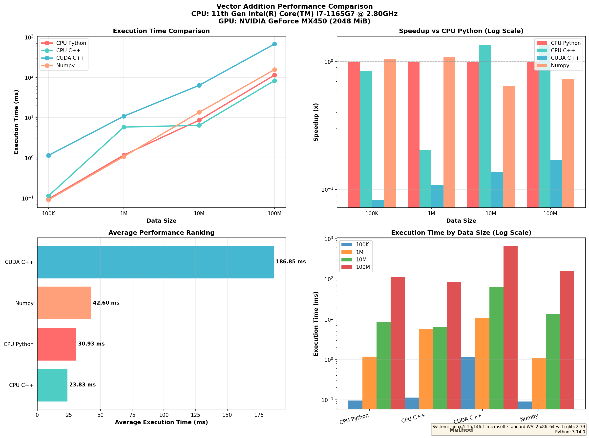

# 벡터 더하기 성능 비교 프로젝트

Python에서 C++를 호출하여 CUDA를 사용하는 프로젝트입니다.
CPU Python, CPU C++, CUDA C++, Numpy 4가지 방식의 성능을 비교합니다.

## 📁 프로젝트 구조

```
project/
├── README.md                    # 프로젝트 설명
├── build.sh                     # 빌드 스크립트
├── main.py                      # 메인 실행 파일
├── pyproject.toml              # Python 프로젝트 설정
├── build/                       # 컴파일된 라이브러리
│   ├── kernel.so               # CUDA 컴파일 결과
│   └── kernel_cpu.so           # CPU C++ 컴파일 결과
├── modules/                     # Python 모듈
│   ├── benchmark.py            # 벤치마크 함수
│   └── chart.py                # 차트 생성
├── src/                         # C++ 소스 코드
│   ├── kernel.cu               # CUDA 커널
│   └── kernel_cpu.cpp          # CPU C++ 구현
└── performance_comparison.png   # 생성된 차트

```

## 미리보기
  

## 🚀 설치 및 실행

### 1. 사전 요구사항

**필수:**
- CUDA Toolkit (GPU 사용 시)
- g++ (CPU C++ 컴파일용)
- Python 3.7+

**Python 패키지:**
```bash
pip install numpy matplotlib
```

### 2. 빌드

```bash
chmod +x build.sh
./build.sh
```

또는 수동으로:

**CPU C++ 컴파일:**
```bash
g++ -shared -fPIC -O3 -fopenmp -o build/kernel_cpu.so src/kernel_cpu.cpp
```

**CUDA C++ 컴파일:**
```bash
nvcc -shared -Xcompiler -fPIC -Xcompiler -O3 -o build/kernel.so src/kernel.cu
```

### 3. 실행

```bash
python main.py
```

## 📊 출력 결과

### 콘솔 출력

```
================================================================================
벡터 더하기 성능 비교: CPU Python vs CPU C++ vs CUDA C++ vs Numpy
================================================================================

📌 주의: CUDA는 메모리 할당/복사/계산/복사 전체 오버헤드를 포함합니다
   단순 덧셈 같은 작은 작업에서는 CPU가 더 빠를 수 있습니다.

데이터 크기: 1,000,000 개 (3.8 MB)
────────────────────────────────────────────────────────────────────────────────
✓ 1. CPU Python      |    1.234 ms ±   0.050 ms
✓ 2. CPU C++         |    0.156 ms ±   0.020 ms
✓ 3. CUDA C++        |    8.500 ms ±   0.500 ms  (메모리 오버헤드 포함)
✓ 4. Numpy           |    0.089 ms ±   0.015 ms

결과 검증:
  CPU Python          | 최대 오차: 0.00e+00
  CPU C++             | 최대 오차: 0.00e+00
  CUDA C++            | 최대 오차: 0.00e+00
  Numpy               | 최대 오차: 0.00e+00

상대 속도 (CPU Python = 1.0배):
  🚀 CPU C++          |  7.91배
  🚀 Numpy            | 13.87배
  🐢 CUDA C++         |  0.14배
```

### 이미지 생성

`performance_comparison.png` 파일이 생성되며, 4개의 차트 포함:

1. **실행 시간 비교** (선 그래프, 로그 스케일)
2. **상대 속도 비교** (막대 그래프, 로그 스케일)
3. **평균 성능 순위** (막대 그래프)
4. **데이터 크기별 비교** (그룹 막대, 로그 스케일)

## 📝 파일 설명

### main.py
- 메인 진입점
- `benchmark.run_benchmark()` 호출
- `chart.print_summary()` 호출
- `chart.create_performance_charts()` 호출

### modules/benchmark.py
- `vector_add_cpu_python()`: 순수 Python + numpy
- `vector_add_cpu_cpp()`: C++ 함수 호출
- `vector_add_cuda_cpp()`: CUDA 함수 호출
- `vector_add_numpy()`: numpy 벡터화 연산
- `run_benchmark()`: 모든 벤치마크 실행

### modules/chart.py
- `create_performance_charts()`: 4개 차트 생성
- `print_summary()`: 종합 결과표 출력

### src/kernel.cu
- CUDA 커널 구현
- `cuda_vector_add()`: C 인터페이스

### src/kernel_cpu.cpp
- CPU C++ 구현
- OpenMP를 사용한 병렬 처리

## 🔧 커스터마이징

### 데이터 크기 변경

`main.py`의 `sizes` 변수 수정:

```python
sizes = [1_000_000, 10_000_000, 100_000_000]  # 기본값
sizes = [100_000, 1_000_000, 10_000_000]     # 더 작은 크기
```

### 반복 횟수 변경

`modules/benchmark.py`의 `run_benchmark()` 함수에서:

```python
benchmark_method("1. CPU Python", vector_add_cpu_python, a, b, iterations=5)
```

## ⚠️ CUDA 성능 관련 주의사항

### CUDA가 느린 이유 (정상입니다!)

CUDA는 다음 단계의 **오버헤드**를 포함합니다:

1. **GPU 메모리 할당** (~1-5ms)
   - `cudaMalloc()`: GPU VRAM에 메모리 할당

2. **Host → Device 메모리 복사** (PCIe 대역폭 제한)
   - 3.8MB: ~0.5-2ms
   - 38MB: ~5-20ms
   - 381MB: ~50-200ms

3. **GPU 커널 실행** (계산)
   - 간단한 덧셈: ~0.1-1ms

4. **Device → Host 메모리 복사** (역시 PCIe 제한)
   - Host → Device와 유사한 시간

5. **GPU 동기화** 대기

### 총 오버헤드 분석

```
CUDA 총 시간 = 할당(1ms) + H2D복사(2ms) + 계산(0.1ms) + D2H복사(2ms) + 동기화(0.1ms)
            ≈ 5-10ms (단순 덧셈 기준)

CPU 시간    = 간단한 덧셈 연산
            ≈ 1-2ms

결론: CPU가 5-10배 빠름!
```

### CUDA가 유리한 경우

- **복잡한 계산**: 매트릭스 곱셈, 이미지 처리, AI 모델 추론
- **대용량 데이터**: 메모리 전송 시간이 계산 시간에 비해 작을 때
- **재사용**: 데이터를 GPU에 유지하면서 여러 번 사용할 때
- **병렬 처리 필요**: 1000개 이상의 스레드 동시 실행

### 벤치마크 해석

| 작업 크기 | CPU가 빠른 이유 | 
|---------|--------------|
| 1-10M   | 메모리 전송 오버헤드 > 계산 시간 |
| 100M    | 단순 덧셈은 CPU 메모리 대역폭도 충분 |
| 1B+     | 더 복잡한 작업이면 CUDA 유리 |


## 📚 참고

- CUDA 설치: https://developer.nvidia.com/cuda-downloads
- OpenMP 문서: https://www.openmp.org/
- matplotlib 문서: https://matplotlib.org/
- claude Haiku 4.5를 이용해서 Vibe Coding으로 작성 되었습니다.